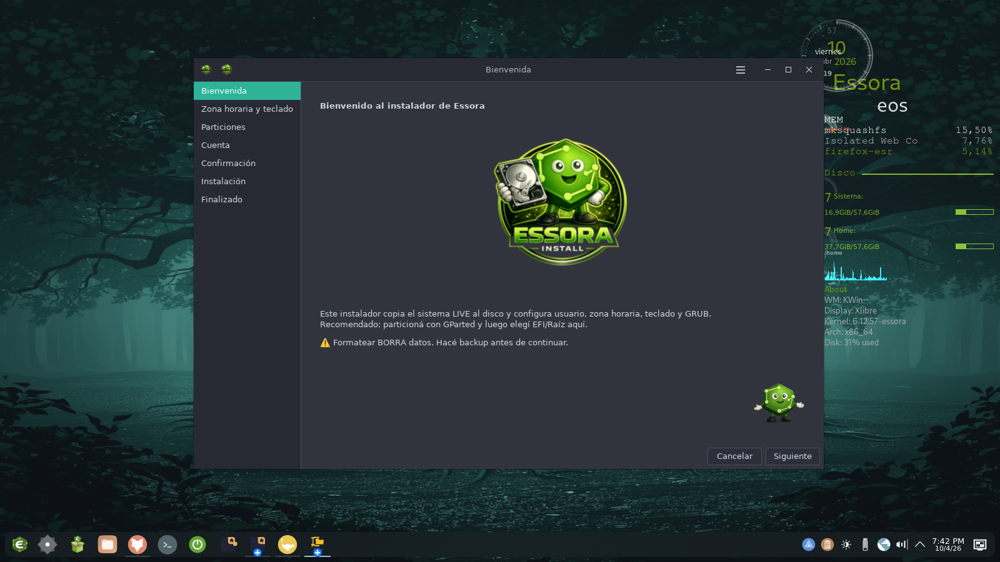
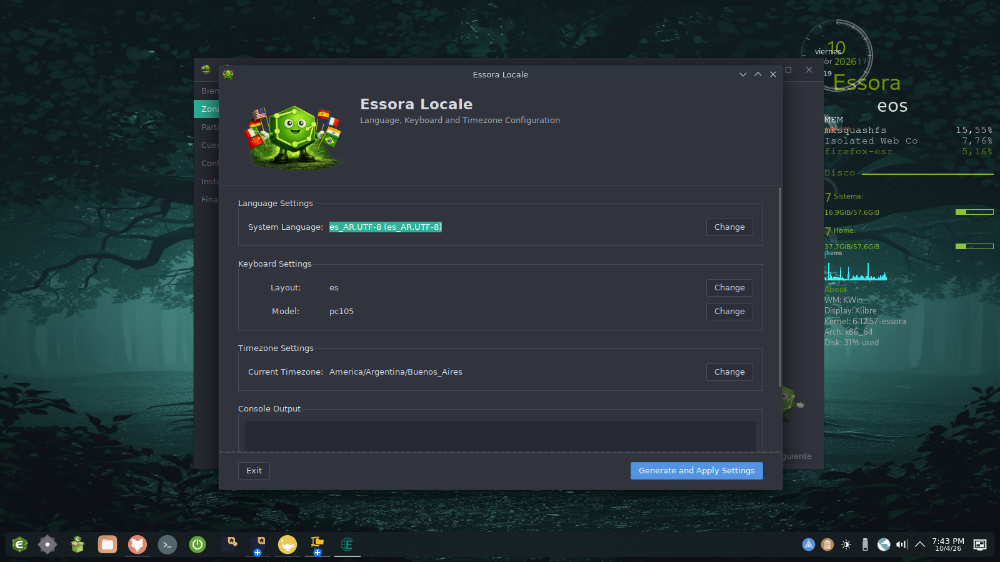
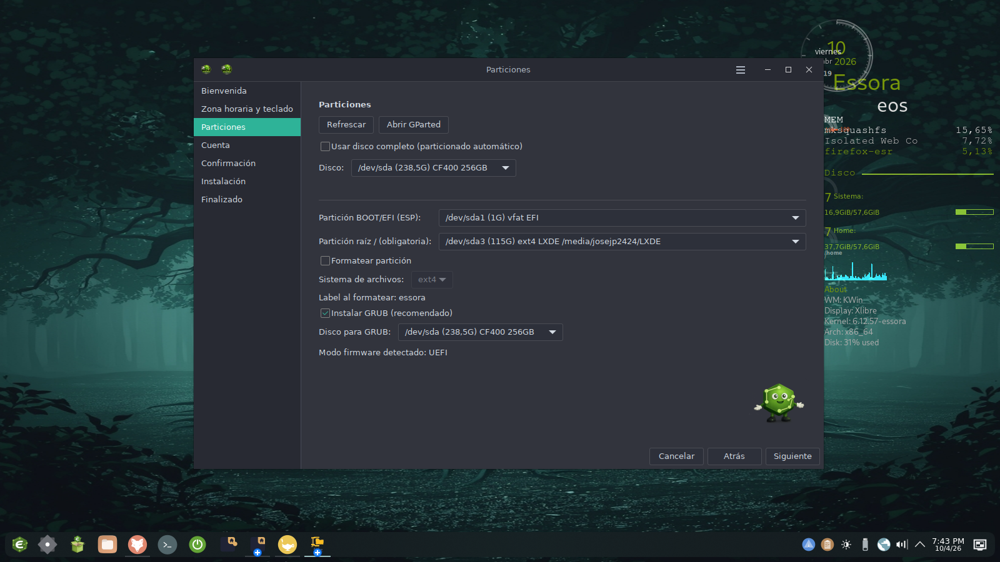

<p align="center">
  
</p>

<h1 align="center">Essora Installer</h1>

<p align="center">
  Graphical live system installer for <a href="https://sourceforge.net/projects/essora/">Essora Linux</a>
</p>

<p align="center">
  
  
  
  
</p>

---

## Overview

**Essora Installer** is a GTK3 graphical installer for [Essora Linux](https://sourceforge.net/projects/essora/), a Devuan-based distribution using OpenRC as the init system. It copies the running live environment directly to disk and configures the user account, hostname, time zone, keyboard layout, and GRUB bootloader — all through a clean, wizard-style interface.

The installer is built entirely in Python 3 using GTK3 (via PyGObject), with no Calamares or Debian-installer dependency. It is distributed as a `.deb` package and runs as part of the Essora Linux live ISO.

---

## Features

### Installation wizard
- **7-step wizard** built with `Gtk.Assistant` — Welcome, Time zone & Keyboard, Partitions, Account, Confirmation, Installing, Finished
- Undecorated window with a custom GNOME-style header bar and application menu
- Per-step validation with real-time feedback before proceeding
- GParted launcher integrated into the Partitions page for partition management

### Disk & filesystem
- Copies the live system to disk using `rsync -aAX` with standard live exclusions
- Supports **ext4** and **ext3** with custom volume label
- Optional separate `/home` partition
- Generates `/etc/fstab` automatically with correct UUIDs
- Supports **UEFI** (x86_64-efi) and **BIOS/Legacy** (i386-pc) GRUB installation
- Formats target partition before install (optional)

### System configuration
- User account creation with username/password validation
- Optional root password or locked root account
- Hostname configuration
- Time zone selector with searchable TreeView dialog
- Keyboard layout and model selector (reads `evdev.lst`)
- Regenerates `/etc/machine-id` after installation
- Disables live autologin (SLiM and OpenRC getty) on the installed system
- Optional SLiM autologin checkbox for the installed system
- KDE/Plasma locale configuration support
- Runs post-install cleanup scripts: removes live user, installer files, and configures SLiM

### Internationalization
- **14 languages** with automatic locale detection:

| Code | Language |
|------|----------|
| `en` | English |
| `es` | Español |
| `ca` | Català |
| `fr` | Français |
| `it` | Italiano |
| `pt` | Português |
| `hu` | Magyar |
| `ru` | Русский |
| `ja` | 日本語 |
| `zh` | 中文 (Simplified) |
| `zh_TW` | 繁體中文 (Traditional) |
| `ar` | العربية |
| `ko` | 한국어 |
| `de` | Deutsch |

- Language selector on the Welcome page — switches the entire UI on-the-fly
- JSON-based translation files under `lang/`

### Other
- About dialog with GPL-3.0 license info, author, and clickable links
- Essora Locale integration (opens `locale-essora` from the Region page)
- Real-time installation log with rsync progress feedback
- Single-instance enforcement

---
---

## Screenshots

<p align="center">
  
</p>

<p align="center">
  
</p>

<p align="center">
  
</p>
---
## Requirements

### Runtime dependencies (`.deb` Depends)

| Package | Purpose |
|---------|---------|
| `python3` | Interpreter |
| `python3-gi` | GTK3 Python bindings |
| `python3-gi-cairo` | Cairo rendering |
| `gir1.2-gtk-3.0` | GTK3 typelib |
| `gir1.2-gdkpixbuf-2.0` | Image loading |
| `gparted` | Partition manager (launched from UI) |

### Tools used at install time (must be present on live ISO)

- `rsync` — live system copy
- `grub-install` / `update-grub` — bootloader
- `mkfs.ext4` / `mkfs.ext3` — filesystem creation
- `blkid` — UUID/type detection
- `mount` / `umount` / `chroot`
- `openssl` — password hashing
- `useradd` / `passwd`

---

## Installation

Install the `.deb` package on the Essora Linux live ISO:

```bash
sudo dpkg -i essora-installer_1.2-1_amd64.deb
```

Or launch directly from the application menu (the `.desktop` file is included).

To run manually (requires root):

```bash
sudo /usr/local/bin/essora-installer.sh
```

---

## File Structure

```
/usr/local/essora-installer/
├── essora-installer.py      # GTK3 frontend (Gtk.Assistant wizard)
├── backend.py               # Installation logic
├── essora-about.py          # About dialog (standalone)
├── translations.py          # JSON translation loader
├── gksu                     # Privilege escalation helper
├── icons/
│   └── essora-installer.png # Application icon (256×256)
└── lang/
    ├── en.json
    ├── es.json
    ├── fr.json
    ├── it.json
    ├── pt.json
    ├── ca.json
    ├── hu.json
    ├── ru.json
    ├── ja.json
    ├── zh.json
    ├── zh_TW.json
    ├── ar.json
    ├── ko.json
    └── de.json

/usr/local/bin/
└── essora-installer.sh      # Launcher script (runs as root)

/usr/local/locale-essora/
└── locale-essora            # Locale configuration tool (external, do not modify)

/usr/share/applications/
└── essora-installer.desktop # Application menu entry
```

---

## Wizard Steps

| Step | Page | Description |
|------|------|-------------|
| 1 | **Welcome** | Language selector, distribution logo, intro text |
| 2 | **Time zone & Keyboard** | Searchable timezone TreeView, keyboard layout/model selectors, Essora Locale launcher |
| 3 | **Partitions** | Root partition, optional EFI partition, optional `/home` partition, filesystem type, GParted launcher |
| 4 | **Account** | Username, full name, user password, root password (optional), hostname, SLiM autologin toggle |
| 5 | **Confirmation** | Summary of all choices, GRUB disk selector, format checkbox |
| 6 | **Installing** | Live progress log, rsync feedback, step-by-step status |
| 7 | **Finished** | Success message, reboot button |

---

## License

Copyright (C) 2026 josejp2424

This program is free software: you can redistribute it and/or modify it under the terms of the **GNU General Public License** as published by the Free Software Foundation, either version 3 of the License, or (at your option) any later version.

See [LICENSE](https://www.gnu.org/licenses/gpl-3.0.html) for the full text.

---

## Author

**josejp2424**
- GitHub: [https://github.com/josejp2424](https://github.com/josejp2424)
- SourceForge: [https://sourceforge.net/projects/essora/](https://sourceforge.net/projects/essora/)
- Contact: [Telgram Essora](https://t.me/essoralinux#)

---

## Part of the Essora Linux ecosystem

Essora Installer is one component of the broader Essora Linux project, a Devuan-based distribution using OpenRC, SLiM, and a curated set of GTK3 applications built for a lightweight, fast-booting, and cohesive desktop experience.

Other tools in the ecosystem include: Essora Store, Essora Firewall, Essora Updater, Essora System Center, Essora Remaster, and more.
